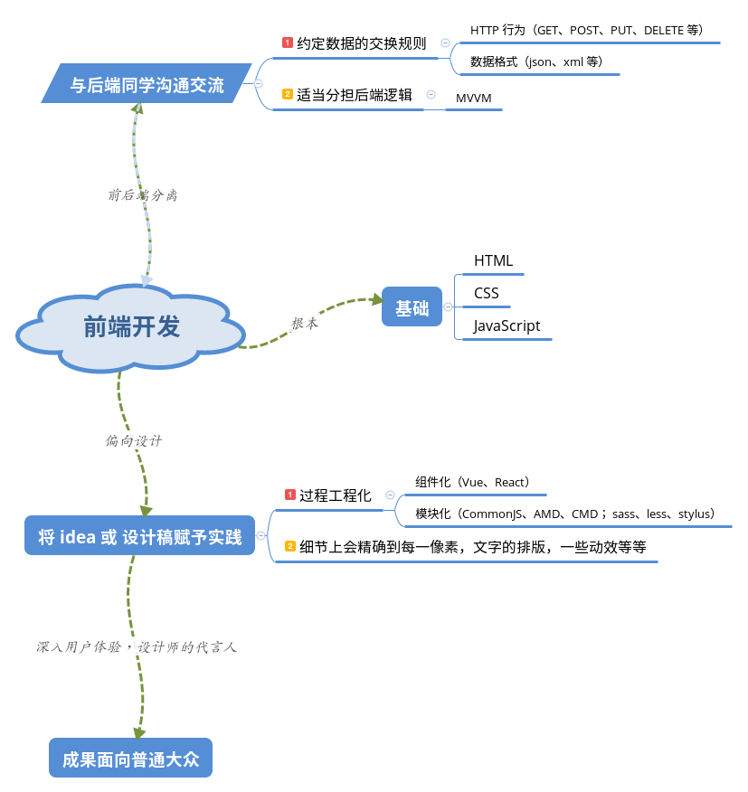

# 我眼中的前端世界

## 我的理解

接触并且正式入坑前端也有近两年了，谈谈我个人对于前端开发的一种理解吧，全为个人体验之谈。

## 偏向设计

所谓偏向设计，便是前端开发的最终目的便是将脑子里的 idea 或者设计师提供的设计稿赋予实践，具体开发中会精确到每一像素，还有文字的排版样式，以及一些动效等等，其最终成果是面向于普通大众的。

## 于后端的交流

前端开发只要不是单纯的静态展示页面，势必会涉及到数据的操作，而数据的具体处理过程是交由后台的同学的来实现的（插一句，相对于前面提到的，我认为后端开发的最终成果是面向专业人士的，比如我们前端的同学），所以在前后端分离大行其道的今天，为了提高开发效率，前后端同学就有必要事先约定数据的交换规则。包括数据的格式（一般 json 比较多还有 xml 之类的）；还有 HTTP 行为（GET、POST、PUT、DELETE ...）。

在约定完一些规则之后，为了缓解服务器的压力前端的同学可以适当地将一些后端逻辑放到浏览器上来解决，代表成果就是 MVVM 了。

## 自身的开发架构

现在的前端开发其需求已不单单满足于 Web1.0 时代单纯的信息发布，上网随便打开一个页面里面充斥各种 css 样式表以及 javascript 脚本，而页面内容也是更为丰富，功能也更加齐全。很多更俨然就是个单页面应用（SPA）。

所以 Web1.0 时代的开发手段对于应用级别的开发已是捉襟见肘，为了适应从 WebPage --> WebApp 的转化，随之而来的便是前端工程化。

### 前端工程化

首先很明显，前端工程化不是一种技术手段而是一种思维方式，它所要解决的问题是：

- 如何提高开发效率也就是解放生产力了
- 如何提升代码的可维护性（包括代码规范、文档整理等等）
- 如何实现性能的优化

于是各种开发工具也就层出不穷，就拿我本人所接触过且用的比较频繁的来说吧：

- git 版本控制，多人协作开发
- npm 强大的包管理，以及灵活的 npm scripts
- gulp 自动化构建工具
- webpack 出色的打包能力
- sass/scss 一种 css 预编译手段
- eslint JS 代码规范，[入门](https://csspod.com/getting-started-with-eslint/)
- postcss [CSS 开发中的瑞士军刀](https://happycoder.net/what-is-postcss/)
- ...

对于这些工具我的态度是看需求，自己用着方便即可（学习其实现原理另说，轮子之心不死啊😄），毕竟我们的目的是利用工具来简化流程方便开发管理。

而前端工程化具体到技术实现便是模块化开发和组件化开发。

#### 模块化

组件化的核心思想就是：复用且分而治之。

对于 JS 而言，实现就多了：

- CommonJS 最为熟悉的应用便在是 NodeJS 中，不适用浏览器环境
- AMD (Asynchronous Module Definition) 弥补 CommonJS 在浏览器环境下的尴尬处境，推崇依赖前置，在定义模块的时候就要声明其依赖的模块
- CMD (Common Module Definition) 推崇就近依赖，只有在用到某个模块的时候再去 require

[AMD 和 CMD 的区别有哪些？](https://www.zhihu.com/question/20351507)

CSS 中模块化的实践就是 sass、less、stylus（表示只用过 sass）就不多解释了。

#### 组件化

那什么又是前端组件化呢？积木都玩过吧或者都听说过吧😂，前端组件就类似于那一个个几何形状的椎啊柱啊，每一个组件之间都是相互独立的个体，拥有一套完整的视觉效果和一些功能，具体到每个组件它都就近维护这自己的一套资源。代表框架 Vue、React。

