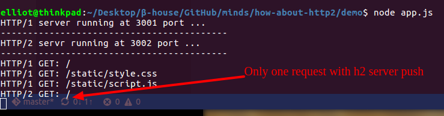
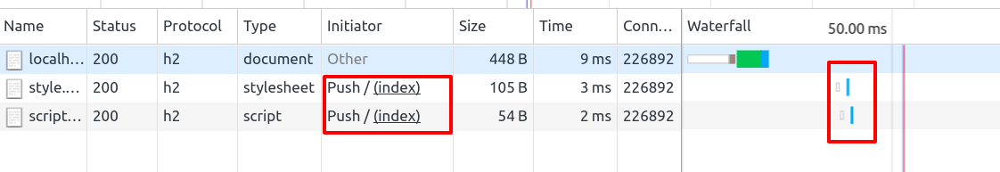

## Set Up

1. 安装依赖 & Start Server

```bash
npm install && node app.js
```

2. 访问

HTTP/1 Server:

```bash
http://loaclhost:3001
```

HTTP/2 Server:

```bash
https://loaclhost:3002
```

3. My Data

启动服务后首次加载，抛开 ssl 开销不说， Server Push 带来的收益还是挺不错的





