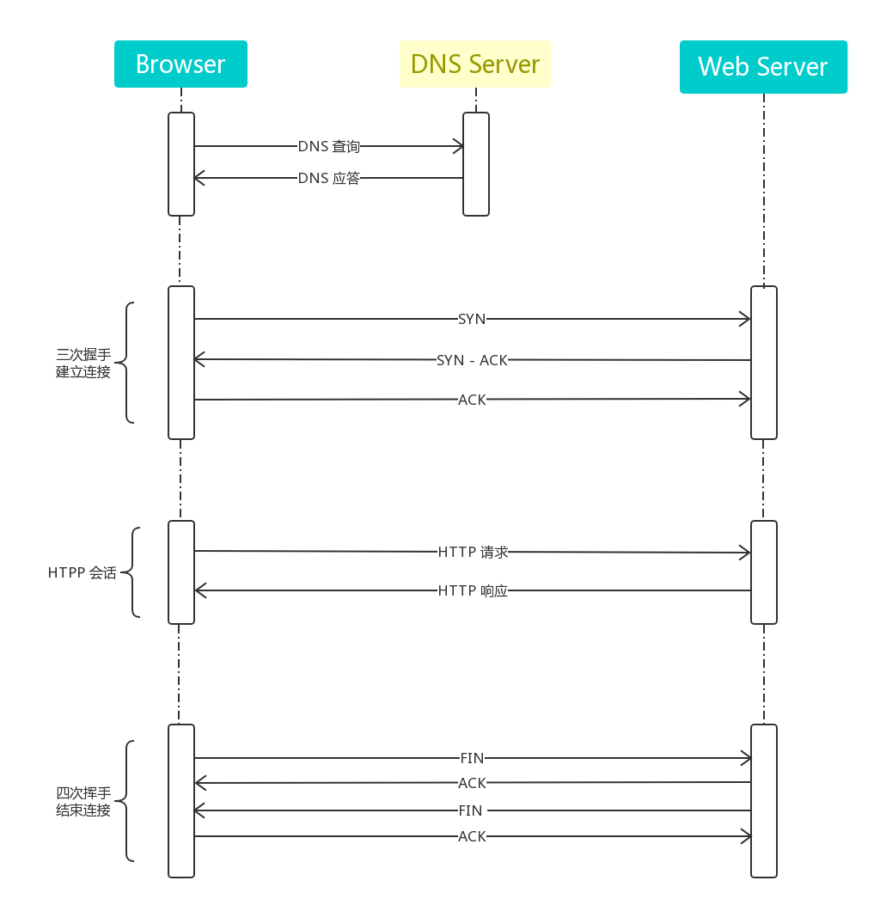
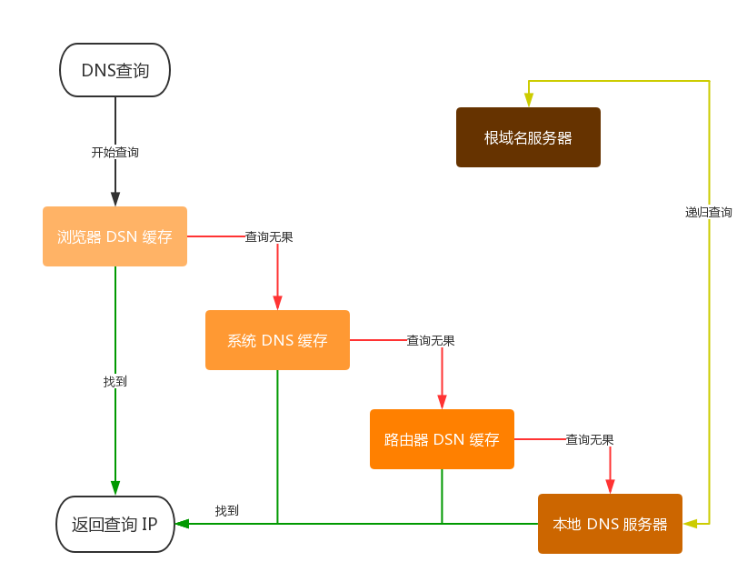
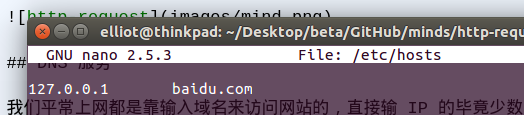
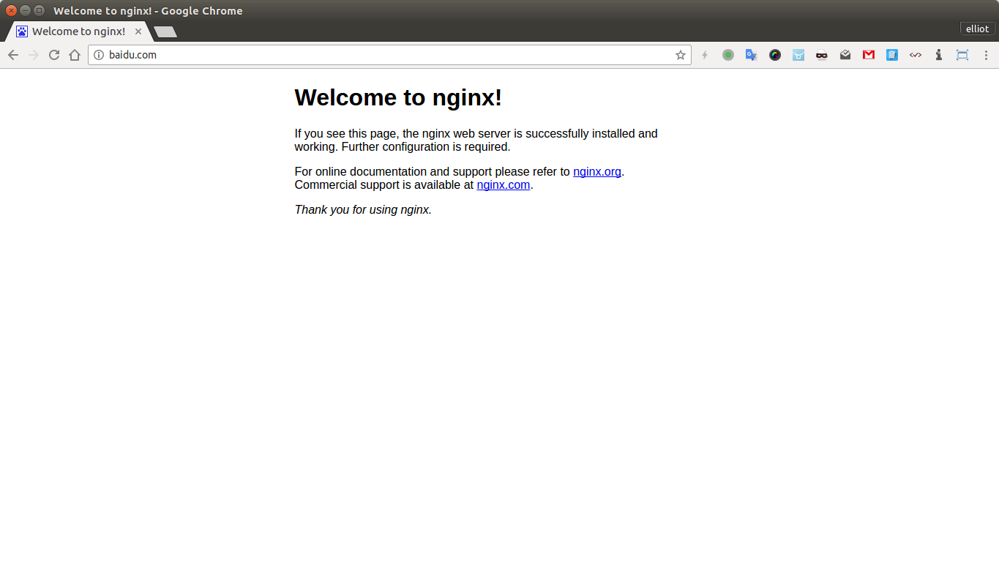
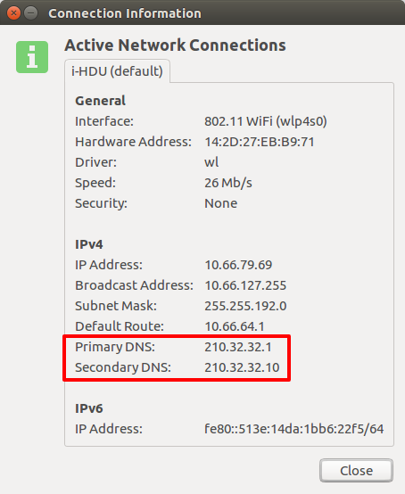
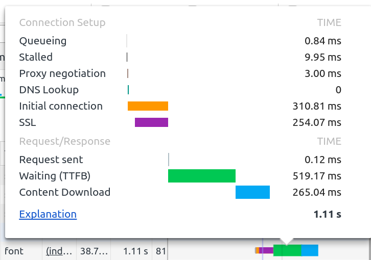

# 从前端角度看待一次完整的 HTTP 请求

## 我的理解



## DNS 服务

我们平常上网都是靠输入域名来访问网站的，直接输 IP 的毕竟少数， 因为相比 IP 地址那是给计算机看的，只有域名才符合我们人的记忆逻辑。所以就有必要存在一套服务解决这尴尬的'人机'需求，DNS 服务就运应而生了。

DSN 全称 Domain Name System 即 域名系统，是和 HTTP 协议一样位于应用层的协议。它提供域名到 IP 地址之间的解析服务。

### 浏览器处理过程的简单流程



①：首先从浏览器 DSN 缓存读取 IP，若找到相应 域名/IP 记录，则直接返回结果结束查询；

> 注：浏览器缓存有大小、时间的限制，时间太长不能及时更新 IP 记录，太短则每次请求都要解析一次 DNS

②：若浏览器缓存查询未果，就向本机系统缓存查找，也就是 hosts 文件（fq 方式之一）,ubuntu 下在可 `sudo nano /etc/hosts` 进行人为修改（典型的 DSN 欺骗手段）；

看效果就知道啦：





③：若系统缓存中也找不到，那么查询请求就会发向路由器，它一般会有自己的DNS缓存。

④：若还是未果，就只能查询ISP DNS 缓存服务器了。

> 注：查看网络配置都会有 "DNS服务器地址" 这一项，操作系统会把域名转发给本地的域名服务器（例如我是在学校接入的无线网络，那么这里的本地域名服务器就在学校的网络中心了）。大约80%的域名解析都到这里就已经完成了，所以 ISP DNS 主要承担了域名的解析工作。



⑤：最无奈的结果就是以上查询都未果，就只能求助根域名服务器了，再之后的流程就是不断请求更新本地 IP 记录，再更新再查询，直到查到对应 IP...

> 例：google font
>
> com
>
> google.com
> 
> fonts.google.com
>
> xx.xxx.xx.xx

先看一个截图：



所以前端 DSN 优化还是必要的，

meta 标签告知浏览器, 我这页面要做 DNS 预解析：

```html
 <meta http-equiv="x-dns-prefetch-control" content="on" />
```

或者 link 标签来强制对DNS做预解析:

```html
<link rel="dns-prefetch" href="http://example.com/" />
```

## 三次握手建立连接

为了确保准确的将数据送达目标，TCP 协议采用了三次握手的策略。

> 一次：发送端（Browser）首先发送一个 SYN 报文给接收方（服务器）；
>
> 二次：接收方收到后，回传带有 SYN/ACK 标志的数据包以表确认信息；
>
> 三次：最后发送方回传一个 ACK 报文，代表“握手”结束


TCP 握手是需要时间开销的，而现代浏览器单域最大 TCP 连接数一般为 4～6 个左右，超过这个数量级的连接请求将被暂时挂起；

所以HTTP1.x 时代所以前端优化也是必不可少的（HTTP/2多路复用就没这些个问题了），例如 合并资源、非首屏资源惰性加载、雪碧图等 hack 减少 HTTP 请求带来的 TCP 连接开销。

## HTTP 会话阶段

浏览器发送 HTTP 请求（GET、POST、PUT、PATCH、DELETE）；服务端处理响应请求（2xx、3xx、4xxx、5xx）。

## 四次挥手结束连接

> 一次：双方均可主动结束连接，主动断开的一方发送 FIN 数据包给对方；
>
> 二次：当被动关闭的一方收到FIN报文时，它会发送ACK确认报文
>
> 三次：当被动关闭的一方被动关闭连接也会发送 FIN 数据包给主动方；
>
> 四次：主动关闭一方收到 FIN 后也发送 ACK，然后整个连接关闭

有时候被动关闭的一方可能会将 ACK 和 FIN 合到一起发送，所以这也算不上严格的四次握手（四个报文段）。

## 参考文档

- <http://imweb.io/topic/55e3ba46771670e207a16bc8>