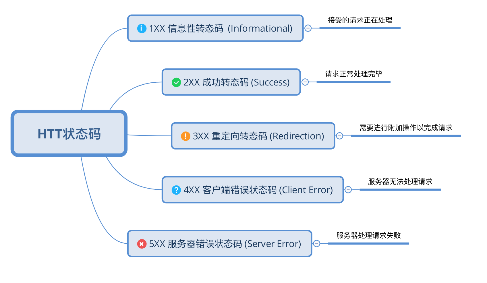

# HTTP 状态码

## 我的整理

HTTP 状态码往多了说有60余种，在此整理记录常用具有代表性的几种。

## 2XX 

请求被成功处理

- 200 请求处理成功并返回相应信息
- 204 请求处理成功，但没有资源返回
- 206 Partial Content 范围请求，响应报文中包含由 Content-Range 指定范围的实体内容

## 3XX 

基本上与重定向有关

- 301 Moved Permanently 永久性重定向，规范是不允许客户端在重定向时改变请求方式，但是很多浏览器视为303响应，并用 GET 方式访问 Location 中的 URI
- 302 Found 临时性重定向，规范同 301 不允许客户端在重定向时改变请求方式 ...
- 303 See Other 重定向，重新以 GET 方式获取相应资源
- 304 Not Modified 多用于缓存机制中
- 307 Temporary Redirect 临时重定向，不会重写请求方式 (POST -> GET)

## 4XX

多在客户端引起的错误

- 400 请求报文中存在语法错误 （例如：POST JSON 时 json 格式出错服务器无法理解请求）
- 401 认证失败
- 403 请求被拒，权限不足
- 404 一般用于请求资源不存在或者拒绝请求但不想表明原因

## 5XX

服务器本身发生错误

- 500 Internal Server Error 服务器处理请求时出错，多为 web 应用程序 bug 所致
- 503 Server Unavailable 多出现于服务器处于超负载或停机维护时，无法处理请求

## 参考书籍

《图解HTTP》
