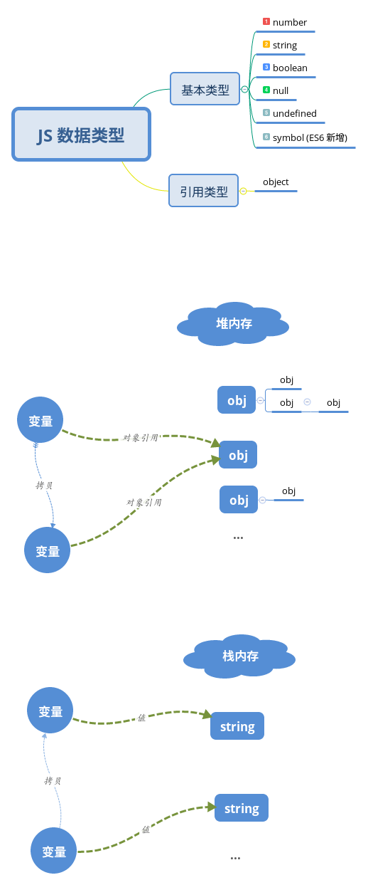

# JS 数据类型

## 我的理解

JS 中的变量是没有类型的,只有值才有；变量可以随时持有任何类型的值，语言本身是没有强制要求变量至始至终维持同一类型的值；

## 基本类型

JS 中基本类型的数据值都存在栈内存中，存取快速；这一类型的数据都按值访问。

- number
- string
- boolean
- null
- undefined
- symbol (ES6 新增)

## 引用类型

引用类型的数据值存于堆内存中；一个变量若为引用类型时其值为指向堆内存的指针，且在复制时也就是其指针的拷贝，而非值的拷贝。

一切对象都按引用访问

