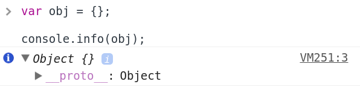
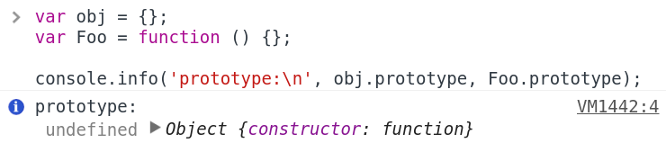

# JS 原型

## 我的理解

## \_\_proto\_\_ 还是 prototype ？

`__proto__` 是浏览器生产商给出的，用于访问对象的原型，并非 JS 标准中内容，应尽量避免在生产环境中使用

`prototype` 是构造函数的特有属性，为 JS 标准中的内容，通过构造函数创建的对象会自动引用对应构造函数 prototype 上的属性和方法

值得注意的是：其它对象没有 `prototype` 属性

