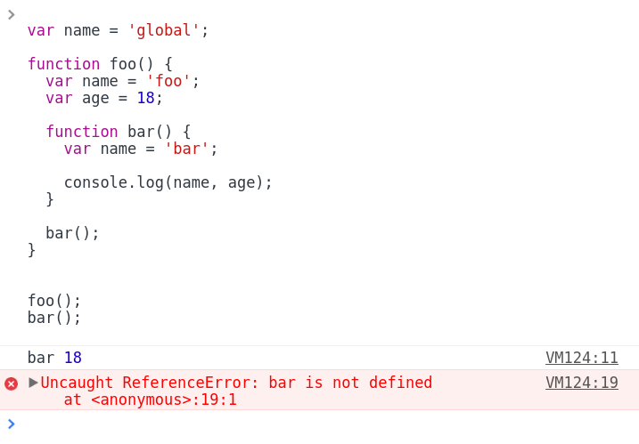
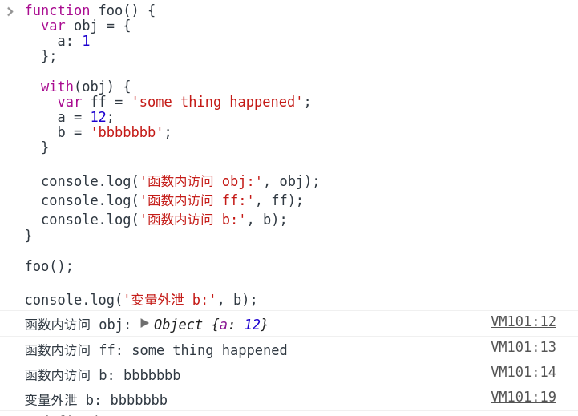

# JS 作用域


## 何为作用域？

简单来说，就是一套规则，用于程序确认在何处以及如何查找变量

那为什么需要这么一套规则？

程序有趣的运行势必离不开变量的协助，然而对于程序而言用到变量就意味着要先去寻得变量（它在哪里？）当然光知道了在哪还不行，还得知道怎么拿到变量，并且不能乱拿，所以就需要一套规则来约束程序有序合理地获取变量。

就好比早上起床我（程序）要刷牙了，势必要用到牙膏牙刷（变量），那么得先知道它们放在哪了吧，然后我睡眼一眯，我的脸盆里有放着牙膏牙刷，室友的脸盆里也有还是新的呢，虽然睡意尚在但也不能糊涂了不是，不能把室友的拿来用哈（不能乱拿，要有规则）。

## 作用域的工作模式

作用域共有两种主要的工作模式：

- 词法作用域
- 动态作用域

其中词法作用域模式广为多数编程语言所采用，JS 便在此列。

## 词法作用域

简单地说，词法作用域是由你在写代码时将变量和块作用域写在哪里来决定的。

话句话说就是，你变量在哪定义其作用域便在哪。

## JS 的情况

与其它语言不同 JS 在 ES6 标准之前并无真正意义上的块作用域，最为实用到的便是全局作用域和函数作用域。

多说无益，看图说话：


① 包含着整个全局作用域，变量 name，函数 foo 所处全局作用域

② 包含着函数 foo 创建的作用域，变量 name 、age，函数 bar 所处函数 foo 创建的作用域

③ 包含着函数 bar 创建的作用域，其中只有一个标识符：name

执行这段程序首先输出 'bar 18'，然后报引用错误 `ReferenceError: bar is not defined`。



可见在 JS 中函数在执行查找变量时，根据当前所处作用域由内向外查找，如果多层的嵌套作用域中存在同名变量时，内部作用域的变量值将屏蔽外部作用域的同名变量的值，简单来说就是由内向外就近原则；

此外，外部作用域无法直接访问其内部作用域中的变量或者函数。

## 再理解词法作用域

为了加深词法作用域的理解，比较下面两段程序：

程序1：

```javascript
var name = 'global';

function foo() {
  var name = 'foo';

  function bar() {
    console.log(name);
  }

  bar();
}

foo();
```

程序2：

```javascript
var name = 'global';
var getName = function() {
  console.log(name);
}

function foo() {
  var name = 'foo';
  var bar = getName;

  bar();
}

foo();
```

执行结果输出，程序1：'foo'，程序2：'global'。

程序1中的函数 bar 在函数 foo 所创建的作用域中被声明，结果输出为 'foo' 不难理解；

程序2中变量 bar 在函数 foo 所创建的作用域中声明，且被赋值为 getName，而 getName 为全局作用域中的一个引用类型的变量，其在栈内存中存储的不是一个直接量，而是指向一个匿名函数的地址（指针），所以在被赋值给变量 bar 时，只是进行了一个地址的拷贝，变量 bar 和 getName 都指向同一个函数对象。这样一来程序2运行 bar() 就等同于调用 getName() ,而 getName 处于全局作用域，继而输出 'global'。

可见，无论函数在哪被调用，也无论它如何被调用，它的词法作用域都只由函数被声明（定义）时所处的位置决定。

## 块作用域

### ES6 之前的实现

1.） `with` 关键字可以将一个对象处理为一个完全隔离的词法作用域，这个对象的属性将将被处理为这个作用域中的变量，外部无法访问。

```javascript
var obj = {
  a: 1
};

with(obj) {
  a = 12;
}

console.log(a);

//  => Uncaught ReferenceError: a is not defined
```

尽管 `with` 块可以将一个对象处理为词法作用域，但也很明显这样的存在却也十分鸡肋，然并卵，而且有时会产生意向不到的结果。

看下面这段代码：

```javascript
function foo() {
  var obj = {
    a: 1
  };

  with(obj) {
    var ff = 'some thing happened';
    a = 12;
    b = 'bbbbbbb';
  }

  console.log('函数内访问 obj:', obj);
  console.log('函数内访问 ff:', ff);
  console.log('函数内访问 b:', b);
}

foo();

console.log('变量外泄 b:', b);
```

结果：



由此可见，在 `with` 内部正常 `var` 声明的变量并不会限制在这个块作用域中，而是被添加到 `with` 所处的函数作用域中，还有非对象 obj 的属性名将被当做变量提升到全局作用域中。

此外 `with` 是在运行时创建新的作用域的，抛开其‘鸡肋’的存在不说，性能就不敢恭维了，所以并不建议使用（在严格模式中 with 被完全禁止）。

2.） `try/catch` 中 try 语句强制抛出的错误可被用于变量定义，仅在 catch 内部有效，间接地实现了块作用域的效果。

```javascript
try{
  throw 'err can be used as variable';
} catch(err) {
  console.log(err);  // => 'err can be used as variable'
  err = 'change the value';
  console.log(err);  // => 'change the value'
}

console.log(err);  // => 'Uncaught ReferenceError: err is not defined'

```

当然与 with 类似在非严格模式下 try/catch 任一分支中 var 声明的变量将被添加到其外一层作用域中，未 var 声明的变量将直接提升至全局作用域中；

此外，在 IE8 及其之前版本中 catch 语句中捕获的的错误对象将被添加到所处作用域中，而非 catch 语句内，即 catch 外部依旧可访问到错误对象，IE9 修复了该 bug。

### ES6 语法糖

1.） let 关键字在 '{ .. }' 内部声明变量便是一个块作用域，在同一作用域内不能重复定义变量，还有与 var 不同的时不存在变量提升，其它用法与 var 类似。

```javascript
{
  let a = 0;
}

console.log(a);

//  => 'Uncaught ReferenceError: ada is not defined'
```

2.) const 声明一个只读的常量。一旦声明，常量的值就不能改变，而且一旦声明变量，就必须立即初始化，不能留到以后赋值，所以对于 const 只声明不赋值，就会报错。

值得注意的是：

> ES6 标准规，如果区块中存在 let 和 const 命令，这个区块对这些命令声明的变量，从一开始就形成了封闭作用域。凡是在声明之前就使用这些变量，就会报错。这一特定被称作为暂时性死区（temporal dead zone，简称 TDZ）

## 欺骗词法

欺骗词法，即，在运行时修改（创建）词法作用域。

- with
- eval

with 之前有说明，我们来看看 eval:

```javascript
function foo(str) {
  eval(str);
  console.log(a);
}

foo('var a = 0;');
```

eval 接受一个字符串为参数，并将其内容视为好像书写时就存在这个位置的代码。这样以来就可以利用程序动态产生代码并运行，就好像动态的代码原来就写着在那里一样。

> 所有在运行时修改或者创建新作用域的做法，都是对 JS 引擎优化工作不负责任（这样的做法会导致引擎无法对作用域的查找进行优化）

## 学习文档

- 《你不知道的JavaScript（上卷）》
- [ECMAScript 6 入门 - By 阮一峰](http://es6.ruanyifeng.com/#docs/let)