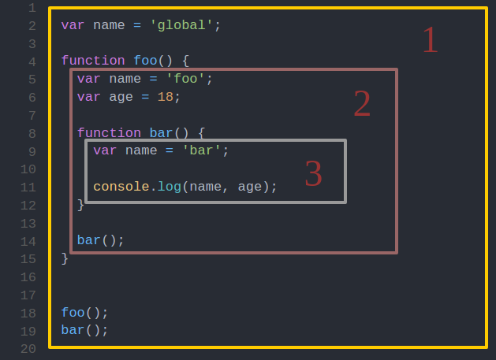

# JS 作用域

## 何为作用域？

简单来说，就是一套规则，用于程序确认在何处以及如何查找变量

那为什么需要这么一套规则？

程序有趣的运行势必离不开变量的协助，然而对于程序而言用到变量就意味着要先去寻得变量（它在哪里？）当然光知道了在哪还不行，还得知道怎么拿到变量，并且不能乱拿，所以就需要一套规则来约束程序有序合理地获取变量。

就好比早上起床我（程序）要刷牙了，势必要用到牙膏牙刷（变量），那么得先知道它们放在哪了吧，然后我睡眼一眯，我的脸盆里有放着牙膏牙刷，室友的脸盆里也有还是新的呢，虽然睡意尚在但也不能糊涂了不是，不能把室友的拿来用哈（不能乱拿，要有规则）。

## 作用域的工作模式

作用域共有两种主要的工作模式：

- 词法作用域
- 动态作用域

其中词法作用域模式广为多数编程语言所采用，JS 便在此列。

## 词法作用域

简单地说，词法作用域是由你在写代码时将变量和块作用域写在哪里来决定的。

话句话说就是，你变量在哪定义其作用域便在哪。

## JS 的情况

与其它语言不同 JS 在 ES6 标准之前并无真正意义上的块作用域，最为实用到的便是全局作用域和函数作用域。

多说无益，看图说话：

① 包含着整个全局作用域，变量 name 、函数 foo 所处全局作用域

② 包含着函数 foo 创建的作用域，变量 name 、函数 bar 所处函数 foo 创建的作用域

③ 包含着函数 bar 创建的作用域，其中只有一个标识符：name

执行这段程序输出结果为 'bar'，可见在 JS 中函数在执行查找变量时，根据当前所处作用域由内向外查找，如果多层的嵌套作用域中存在同名变量时，内部作用域的变量值将屏蔽外部作用域的同名变量的值